# data-fetching — Server Components first, never `useEffect` for reads

This skill governs **where data reads land** in a Next.js 16 App Router app. The framework lets you call a `"use server"` function from a Client Component — that's a capability, not a license. Reading data via a Server Action in `useEffect` costs you SSR, streaming, request deduping, caching, and parallelism. The bug is silent: no error, no warning, just worse UX and wasted POSTs.

## When this skill applies

- The user is about to call a Server Action from a Client Component to load data.
- The user is about to add `useEffect` (at all — but especially to fetch).
- The user pastes `"use client" + useState + useEffect + fetch/getX` and asks for review.
- The user is about to convert a page to `"use client"` so it can host filter/tab state.
- The user adds a `"use server"` function whose only job is `SELECT` / read.
- The user asks to **audit** a Next.js codebase against the data-fetching rules.

## Contract

Follows the dev-flow contract — see `references/contracts.md`. Key facts:

- Reads `meta.json#stack.framework` and `stack.nextjs_version`. For `framework = "monorepo"`, reads `stack.monorepo.web.framework` and `stack.monorepo.web.nextjs_version`.
- **Refuses to apply** if:
  - `stack.framework ∉ {"next", "monorepo"}` — Server Components / Server Actions don't exist on RN, Remix, SvelteKit, Astro, plain React, etc.
  - `stack.nextjs_version != "16"` — `searchParams` is async in 16 (was sync in 15), `revalidatePath` import path moved, `refresh()` from `next/cache` is new. Do not silently translate the rules.
  - The project uses Pages Router (`pages/` directory). Different mental model (`getServerSideProps` / `getStaticProps` / API routes / SWR) — refuse rather than translate.
- Appends a `history` entry per refactor.
- Does **not** bump `phase`.

## Companion skills

- **`state-discipline`** (sibling in dev-flow) — owns the broader React-side rule (never bare `useEffect`; derive state, use a query lib, use event handlers, `key` to reset, `useMountEffect` for one-time external sync). Install and follow it alongside this skill.
- **`forms`** — for any UI that persists field values to the backend. Forms are mutation-heavy and have their own toolkit; reads inside a form (e.g. preloading the entity to edit) follow this skill's rules.

If a green example below *looks* like it would have been a `useEffect` in older code, that's the point — it isn't one anymore. The red ❌ blocks show `useEffect` only because that's what the anti-pattern looks like in the wild; never copy from a red block.

## The Rule

**Read data in Server Components. Mutate data with Server Actions. Never use `useEffect` (or `useState + useEffect`) in a Client Component to call a Server Action just to load data.**

Violating the letter is violating the spirit. The signal that you've drifted is not a runtime error (there is none), it's the patterns below: a `getX` action, a `useEffect` that fetches, a page newly converted to `"use client"`. **The absence of a stack trace is not the absence of a problem.**

## Why

> "Server Functions are designed for server-side **mutations**, and the client currently dispatches and awaits them **one at a time**. […] If you need parallel data fetching, use data fetching in Server Components."  
> — Next.js docs, `mutating-data.mdx`

> "Server Actions are queued, and using them for data fetching introduces sequential execution."  
> — Next.js docs, `backend-for-frontend.mdx`

Concretely, a `useEffect`-driven Server Action read costs:

- **No SSR** — the page paints empty, then fetches after hydration. Worst LCP.
- **Sequential queue** — every Server Action call waits on the previous one.
- **No request deduping / caching** — Server Actions always POST.
- **No streaming** — no progressive render with `<Suspense>`.
- **Double-fetch on mount** in Strict Mode dev.
- **Larger client bundle** — fetch logic, loading states, error states ship to the browser.

## Decision: how to load data

The first question is **not** "where does the data need to land?" — it's "**why is this a Client Component at all?**" Most reads belong on the server. If the answer is anything weaker than "polling, focus refetch, or a third party mutates the data without user intent," the fix is to lift the read to a Server Component, not to swap the transport.

```dot
digraph data_fetching {
  "Why is this a Client Component?" [shape=diamond];
  "Server Component, await directly" [shape=box];
  "URL searchParams; page stays Server Component" [shape=box];
  "Promise<T> from Server Component, use() in Client leaf" [shape=box];
  "Route Handler GET + TanStack Query (last resort)" [shape=box];

  "Why is this a Client Component?" -> "Server Component, await directly" [label="It isn't / shouldn't be"];
  "Why is this a Client Component?" -> "URL searchParams; page stays Server Component" [label="Filter / tab / range state"];
  "Why is this a Client Component?" -> "Promise<T> from Server Component, use() in Client leaf" [label="Genuine interactivity at the data boundary, initial data only"];
  "Why is this a Client Component?" -> "Route Handler GET + TanStack Query (last resort)" [label="Polling, focus refetch, or third-party mutates the data"];
}
```



**The branches are not peers.** Top to bottom: Server Component (default, ~90% of cases), URL state (most "I need filters" cases), `use()` + `<Suspense>` (rare), Route Handler + TanStack Query (last resort, narrow scope). Reaching for the bottom branch when an upper branch fits is the most common failure mode of this skill.

**Server Actions are for mutations only.**

## Migrating away from `useEffect` + Server Action — the ladder

If you're staring at `useState` + `useEffect` + a `"use server"` read in a Client Component, walk this ladder **top-down** and stop at the first rung that fits. It's almost always rung 1.

1. **Lift the read to a Server Component.** Convert the page to `async function Page({ searchParams })`, `await` the read at the top, pass data down. If the page has interactive state, ask rung 2 *before* deciding it has to stay client.
2. **Move state to URL `searchParams`.** Tabs, filters, ranges, pagination, sort, search query — all belong in the URL. The Server Component reads the `searchParams` prop and re-renders with new data; the Client leaf **writes** the param with [`nuqs`](https://nuqs.dev) `useQueryState`/`useQueryStates` (typed parsers + built-in URL-update rate limiting — the ecosystem-first replacement for hand-rolled `router.replace`, which stays a fine fallback for a single param; **note `shallow: false` when the Server Component must re-render** — see `references/nuqs.md`). Free streaming, free cache, shareable URL, back-button works. One-time: `<NuqsAdapter>` in the root layout; `createSearchParamsCache` for type-safe reads in nested Server Components. `[VERIFY]` nuqs against Next 16.
3. **Pass `Promise<T>` from Server Component, consume with `use()` + `<Suspense>`.** Only when a Client Component genuinely needs server data as props at mount (charting libs, third-party widgets expecting a synchronous data shape).
4. **`GET` Route Handler + TanStack Query** (recommended default for this rung — retries, request dedup, devtools, mutation helpers; SWR is an acceptable lighter-weight alternative for a single simple polling widget, but don't reach for a second data library once TanStack Query is already in the project). Reserved for: interval polling, focus revalidation, third-party mutates the data outside your app. **Not** for "I already have a Client Component and want to keep it."

### The lateral migration is the failure mode

`useEffect` + action → `useQuery`/`useSWR` + Route Handler in the same Client Component is the wrong refactor. It feels like progress — no more action-as-read — but:

- Page is still `"use client"`. No SSR, no streaming, same bad LCP.
- You traded a sequential POST queue for a sequential `fetch`. Same waterfall.
- "Route Handlers cache!" — not for per-user, per-org reads. Your `/api/cases` is `Cache-Control: private`; the CDN won't touch it.
- You added a network hop, a JSON serialization layer, a client library, an extra route file — for zero cache wins over the Server Component you should have written.

If you reached rung 4 without first asking "can this page simply be a Server Component?", back up.

## The four correct patterns

### 1. Async Server Component — the default

```tsx
// app/(app)/cases/page.tsx
import { listCases } from "@/lib/services/case.service";

export default async function CasesPage() {
  const cases = await listCases();
  return <CasesTable cases={cases} />;
}
```

No `"use client"`, no `useEffect`, no Server Action.

### 2. Stream a promise to a Client Component with `use()` + `<Suspense>`

```tsx
// app/(app)/cases/page.tsx — Server Component
import { Suspense } from "react";
import { listCases } from "@/lib/services/case.service";
import CasesTable from "./_components/cases-table"; // "use client"

export default function CasesPage() {
  const casesPromise = listCases(); // do NOT await
  return (
    <Suspense fallback={<CasesTableSkeleton />}>
      <CasesTable casesPromise={casesPromise} />
    </Suspense>
  );
}
```

```tsx
// _components/cases-table.tsx
"use client";
import { use } from "react";

export default function CasesTable({
  casesPromise,
}: {
  casesPromise: Promise<Case[]>;
}) {
  const cases = use(casesPromise); // suspends until resolved
  // …interactive UI
}
```

The Server Component starts the fetch, streams HTML as soon as it can, the Client Component hydrates with the resolved value. No client-side waterfall.

### 3. Server Action — only for mutations, invoked via `<form>` or event handler after user intent

```ts
// lib/actions/cases.actions.ts
"use server";
import { revalidatePath } from "next/cache";

export async function archiveCase(id: string) {
  await caseService.archive(id);
  revalidatePath("/cases");
}
```

After the mutation, invalidate and let the Server Component re-render with fresh data. Don't return a list to refresh client state by hand.

**Variants — pick the narrowest:**

- `revalidatePath('/cases')` — invalidate by route segment.
- `revalidateTag('cases')` — invalidate by tag (when a service uses `fetch(..., { next: { tags: ['cases'] } })`, `unstable_cache`'s `tags` option, or — under Cache Components — `cacheTag('cases')` inside a `"use cache"` function/component).
- `refresh()` from `next/cache` — inside a Server Action, refresh the client router cache for the current route. Useful when the mutation happens on the same page. Does **not** revalidate tagged data by itself — pair it with `revalidateTag`/`updateTag` when the mutation also needs to invalidate a tag.

**`revalidateTag` signature depends on whether Cache Components (`cacheComponents: true`) is enabled** — see [Cache Components](#cache-components--use-cache-next-16-opt-in) below for the full breakdown:

- **Cache Components off** (default / pre-16 caching model): `revalidateTag('cases')` — single argument, expires the tag immediately. This is what the example above uses and it's correct for projects that haven't opted into Cache Components.
- **Cache Components on**: the single-argument form is **deprecated**. Use either:
  - `revalidateTag('cases', 'max')` in a Server Action or Route Handler — stale-while-revalidate: the current request still gets a fast (possibly stale) response, fresh data loads in the background.
  - `updateTag('cases')` — **Server Actions only**, immediate expiry, read-your-own-writes (the user who triggered the mutation sees the new value on the very next render, not a background refresh). Prefer this over `revalidateTag` inside Server Actions whenever the user needs to see their own change immediately (e.g. after creating or editing the record they're looking at).

### 4. Route Handler + TanStack Query (recommended) / SWR — last resort, narrow scope

Reach for this **only** when the data genuinely changes without user intent: interval polling, focus revalidation, third-party mutates the data outside your app. Anything else belongs in patterns 1–3.

**TanStack Query is the default** for this rung — it's what the project already has if `forms` scaffolded `stack.forms = "tanstack-form"`, and it gives you retries, request dedup, devtools, and mutation helpers for free. Reach for SWR only for a genuinely trivial one-off polling widget in a project that has no other client-side query library; never install both.

```ts
// app/api/dashboard/stats/route.ts — only because the dashboard polls every 5s
import { NextResponse } from "next/server";

export async function GET(req: Request) {
  const range = new URL(req.url).searchParams.get("range") ?? "30d";
  return NextResponse.json(await getDashboardStats(range));
}
```

```tsx
// TanStack Query — recommended default
"use client";
import { useQuery } from "@tanstack/react-query";

export function LiveStats({ range }: { range: string }) {
  const { data } = useQuery({
    queryKey: ["dashboard-stats", range],
    queryFn: () =>
      fetch(`/api/dashboard/stats?range=${range}`).then((r) => r.json()),
    refetchInterval: 5_000,
  });
  return /* … */;
}
```

```tsx
// SWR — acceptable for a single trivial polling widget, no other client query lib in the project
"use client";
import useSWR from "swr";

export function LiveStats({ range }: { range: string }) {
  const { data } = useSWR(`/api/dashboard/stats?range=${range}`, fetcher, {
    refreshInterval: 5_000,
  });
  return /* … */;
}
```

If your Client Component doesn't poll, doesn't refetch on focus, and isn't watching externally-mutated data — **you don't need this**.

## Cache Components / `use cache` (Next 16, opt-in)

Next 16 introduces **Cache Components**, the explicit opt-in caching model, enabled with `cacheComponents: true` in `next.config.ts`. Once on, nothing is cached unless you mark it with the **`"use cache"`** directive — the framework stops implicitly caching and you cache *deliberately*. This is orthogonal to the ladder above: you still default to async Server Components; `"use cache"` is for **expensive reads you want memoized across requests** (a slow aggregate query, a third-party API call, a rarely-changing config), not a replacement for RSC data fetching.

```ts
// next.config.ts
import type { NextConfig } from "next";
const nextConfig: NextConfig = { cacheComponents: true };
export default nextConfig;
```

```ts
// lib/services/case.service.ts — cache an expensive read
export async function getCaseStats() {
  "use cache";                 // file/function/component-level directive
  cacheLife("hours");          // how long this stays fresh (built-in profile or custom)
  cacheTag("cases");           // tag so a mutation can invalidate it
  return db.select(/* expensive aggregate */);
}
```

- **`cacheLife(profile)`** — the freshness/expiry profile (`"seconds"` | `"minutes"` | `"hours"` | `"days"` | `"max"`, or a custom profile in `next.config.ts`).
- **`cacheTag(tag)`** — attaches a tag; a Server Action then invalidates it.

**Invalidation under Cache Components** (this is why the mutation section above branches on the flag):

- **`updateTag('cases')`** — Server Actions only, **immediate** expiry with read-your-own-writes. Prefer it when the user must see their own change on the next render (e.g. right after editing the record they're viewing).
- **`revalidateTag('cases', 'max')`** — the second argument (a cache profile) is **required** here; it's stale-while-revalidate (the triggering request may still see stale data while fresh loads in the background). The **single-argument** `revalidateTag('cases')` is the pre-Cache-Components form and is **deprecated** once `cacheComponents` is on.

If the project has **not** enabled `cacheComponents`, ignore this section: the single-argument `revalidatePath` / `revalidateTag` in the mutation examples above are correct as-is. `[VERIFY]` the exact `cacheLife` profile names and the `revalidateTag`/`updateTag` signatures against the installed Next version — this surface is new in 16 and still settling.

## Instant Navigations (Next **16.3**, stable — opt-in via `cacheComponents`) `[VERIFY]`

Doc-grounded against <https://nextjs.org/docs/app/guides/instant-navigation> (page states `version: 16.3.0`). Not preview — 16.3.0 is the `latest` npm tag. Still **opt-in**: it rides on `cacheComponents: true`, which Vercel says will become a default in a future major.

**Definition.** A navigation is *instant* when the browser starts rendering the moment the user clicks: static/cached/fallback content appears immediately while the server streams the rest into its fallbacks. (Assumes warm caches — a cold cache still computes once.)

**The distinction that explains everything:** a direct visit and a client navigation produce **different initial UI**.
- **Direct visit** → the **static shell** as HTML, typically from a CDN.
- **Client navigation** → only the tree *below the shared layout* re-renders, so a `<Suspense>` boundary sitting **above** that point never triggers. Next generates a per-route **App Shell** for this case.

That's why the same page can be instant on load and blocking on navigation. (Same reason `useSearchParams()` suspends on a page load but resolves synchronously on a client navigation — the router already has the params.)

**Three levers when a route `await`s something:**

| Lever | How | Effect |
|---|---|---|
| **Stream** | wrap in `<Suspense>` | fallback shows instantly, content streams in |
| **Cache** | `'use cache'` (+ `cacheLife`) | the value lands in the shell |
| **Block** | `export const instant = false` in `page.tsx`/`layout.tsx` | opts the segment **out of validation feedback**; that segment's navigation blocks on the server |

⚠️ Read `instant = false` precisely: it silences *insights* for that segment, it does not "make it dynamic". Sibling navigations below it are still validated. Prefer `use cache: private` over opting out when the content depends on `cookies()`/`headers()` but has a known lifetime (needs `stale` ≥ 5 minutes).

**Validation is ON by default** under Cache Components (`validationLevel: 'warning'`): every Page and Default segment is validated in development, simulating both page load and client navigation. Opt down to only-explicitly-marked segments:

```ts
// next.config.ts
const nextConfig: NextConfig = {
  cacheComponents: true,
  experimental: { instantInsights: { validationLevel: 'manual-warning' } },
};
```

**Two `use cache` variants worth knowing** (they change what can be instant):
- **`'use cache: private'`** — for functions reading `cookies()`/`headers()`. Cached **in the browser only**, so it **cannot** be part of the static shell; it pairs with runtime prefetching.
- **`'use cache: remote'`** — persistent caching. Plain `'use cache'` is in-memory and **does not survive across serverless instances**, which is the trap on Vercel.

**Partial Prefetching** (its own adoption guide) changes `<Link>`: each visible link prefetches the destination's **App Shell**, shared across every link to the same route — so rendering a `<Link>` is effectively free (no more one request per link). `prefetch={true}` adds the page content *and* opts into **runtime prefetching**, resolving that link's `params` / `searchParams` / full URL before the click.

**Tooling.** *Navigation Inspector* (DevTools) freezes the page at its initial loading state — "Pause on navigations", then Resume — showing the static shell on direct visits and the prefetched destination on client navigations; pair with the React DevTools Suspense panel. Regression guard: the `instant()` helper from `@next/playwright` (see `write-tests` → `references/test-page-e2e.md`).

**How it maps onto our ladder:** nothing here replaces it. Rung 1 (async Server Component) + `<Suspense>` **is** Stream; the Cache Components section above **is** Cache. What 16.3 adds is a *validator* that tells you when a route silently fell off the ladder, plus the vocabulary to say "this one blocks on purpose".

**Adopting it — don't hand-roll the migration.** Official paths, in order:
1. **[Migrating to Cache Components](https://nextjs.org/docs/app/guides/migrating-to-cache-components)** — the canonical migration guide for an existing app.
2. **[Adopting Partial Prefetching](https://nextjs.org/docs/app/guides/adopting-partial-prefetching)** — the `<Link>` defaults and the migration off `unstable_eager`.
3. **Four official Skills** live in `vercel/next.js/skills/` (install: `npx skills add vercel/next.js --skill <name>`):
   - `next-cache-components-adoption` — flip the flag and walk the app to a passing build (ships a `cache-components-instant-false` codemod).
   - `next-partial-prefetching-adoption` — flip `partialPrefetching`, opt routes in with `export const prefetch = 'partial'`.
   - `next-cache-components-optimizer` — the observe → test → fix → verify loop: confirms the UI renders, writes an `instant()` test that *fails first*, works it to green against a production-like build, leaves it as a regression guard.
   - `next-dev-loop` — the general edit → verify loop (`/_next/mcp` + `agent-browser`), not Cache-Components-specific.
   `[VERIFY]` against <https://nextjs.org/docs/app/guides/ai-agents>. Note Vercel's own rule there: *framework knowledge comes from the bundled docs, not from Skills — Skills cover workflows, not lookups.* That is exactly our rule zero.

## Next 16.3 — what you get by just upgrading `[VERIFY]`

Released 2026-08-03 (`npm install next@latest`). These need **no** config and no code change — recommend the upgrade to any Next 16 project:

- **~90% less dev memory** (Turbopack disk caching + memory eviction, now on by default) and **faster repeat builds** (the filesystem cache now covers `next build`).
- **~22% more requests under load** — the App Router SSR layer moved from web streams to native Node.js streams.
- **TypeScript 7** for type checking during `next build` — just bump the local dep (`pnpm add -D typescript@^7`).
- **Fewer prefetch requests** — small prefetch payloads are bundled together automatically.

New APIs worth knowing (opt-in, no flag):

- **`catchError` from `next/error`** — a custom error boundary that, unlike a plain React error boundary, does **not** interfere with `notFound()` / `redirect()`, and hands you a **`retry()`** that re-fetches the boundary's children **including re-rendering failed Server Components**. This is the missing piece for "the read failed, let the user retry" — previously you could only reset client state.
- **`import.meta.glob`** (Vite-compatible, via Turbopack) — load many local files from a Server Component with HMR, e.g. a folder of markdown posts.

Experimental in 16.3, flag-gated: the **Rust React Compiler** (`reactCompiler` + `experimental.turbopackRustReactCompiler`) and **network resilience** (`experimental.useOffline` + a `useOffline()` hook from `next/offline`, which keeps a navigation/fetch/Server Action pending and retries on reconnect instead of throwing).

## Anti-pattern catalog — red ❌ → green ✅

The full red→green catalog (6 patterns: action-in-useEffect, useState-filter, manual-refetch-after-mutation, getX-in-actions, await-then-pass-to-client, optimistic-by-hand) is in `references/anti-patterns.md`. Brief index:

1. **Reading via Server Action in `useEffect`** → async Server Component.
2. **Filter / tab state in `useState`, refetched via action** → URL `searchParams` + Server Component re-render.
3. **Manual re-read after mutation** → `revalidatePath` / `revalidateTag` / `refresh` inside the action.
4. **`"use server"` file containing read-only `getX`** → move reads to `lib/services/`, called directly from Server Components.
5. **`await` in parent then pass to Client (blocks streaming)** → pass unawaited `Promise<T>`, consume with `use()` + `<Suspense>`.
6. **Optimistic UI by hand (`useState` + manual diff)** → `useOptimistic` + `revalidatePath` inside the action.

## Service layer placement

Reads live in `lib/services/<entity>.service.ts` — called directly from Server Components.

```ts
// lib/services/case.service.ts
import { db } from "@/lib/db";
import { cases } from "@/lib/db/schema";
import { requireOrgPermission } from "@/lib/auth";

export async function listCases(filters: CaseFilters = {}) {
  await requireOrgPermission("org:cases:read");
  return db.select().from(cases).where(/* … */);
}
```

Mutation actions in `lib/actions/<entity>.actions.ts` import the service for the write side. **No `getX`/`listX`/`findX` in `lib/actions/`.** Service stays the single source of truth.

## Workflow

### Step 1 — verify the contract

Read `.workflow/meta.json`. Confirm `stack.framework ∈ {"next", "monorepo"}` and `stack.nextjs_version = "16"`. Else refuse, explain why.

### Step 2 — diagnose the call site

For a refactor request, walk the ladder top-down. For a new read, default to pattern 1 (async Server Component) unless the user has a stated reason for rungs 2–4.

### Step 3 — apply the pattern

Refactor / scaffold per the matching pattern above. If the read currently lives in `lib/actions/`, move it to `lib/services/` first (anti-pattern 4).

### Step 4 — append history

```json
{
  "skill": "data-fetching",
  "ran_at": "<now>",
  "outputs": ["app/(app)/cases/page.tsx", "lib/services/case.service.ts"],
  "phase_before": "<unchanged>",
  "phase_after": "<unchanged>"
}
```

## Audit mode

When the user asks "audit my codebase against data-fetching" / "scan for read anti-patterns", produce a report. The audit recipe (ripgrep queries for each violation, severity rubric, report template) lives in `references/audit-recipe.md`.

Violation kinds:

| Code | Violation | Severity |
|---|---|---|
| A | `useEffect` calling a Server Action (`getX`/`listX`/`findX`) | high |
| B | `useState + useEffect + fetch` in a Client Component for initial data | high |
| C | Filter/tab state in `useState` causing client-side refetch loop | high |
| D | `"use server"` file containing read-only `getX`/`listX`/`findX` | medium |
| E | `await` in Server Component then pass result to Client (no `<Suspense>` streaming) | medium |
| F | Manual list re-read after mutation (no `revalidatePath` / `revalidateTag`) | high |
| G | Route Handler + SWR for a read that should be a Server Component | medium |

## Sources

This skill is derived from the `nextjs-data-fetching` skill from **[lusentis/next-skills](https://github.com/lusentis/next-skills)** (MIT-licensed), adapted to the dev-flow contract (reads `meta.json#stack.framework` / `stack.nextjs_version`, appends `history`, refuses on mismatch). The migration ladder, decision graph, four patterns, and anti-pattern catalog are preserved.

- Original: <https://github.com/lusentis/next-skills/tree/main/nextjs-data-fetching>
- Next.js docs (Fetching data): <https://nextjs.org/docs/app/getting-started/fetching-data>
- Next.js docs (Mutating data): <https://nextjs.org/docs/app/getting-started/mutating-data>
- React `use()`: <https://react.dev/reference/react/use>
- `revalidatePath` / `revalidateTag`: <https://nextjs.org/docs/app/api-reference/functions/revalidatePath>
- **`references/nuqs.md`** — the doc-grounded how-to for rung 2 (URL state): `useQueryState`/`useQueryStates`, parsers, `shallow`/`limitUrlUpdates`/`history` options, and `createSearchParamsCache` for the server side. Read it before wiring URL state — don't improvise the API.

## When in doubt

Ask: "why is this a Client Component at all?" If the honest answer is anything weaker than polling / focus refetch / third-party mutation, the read belongs on the server. Lift it.
